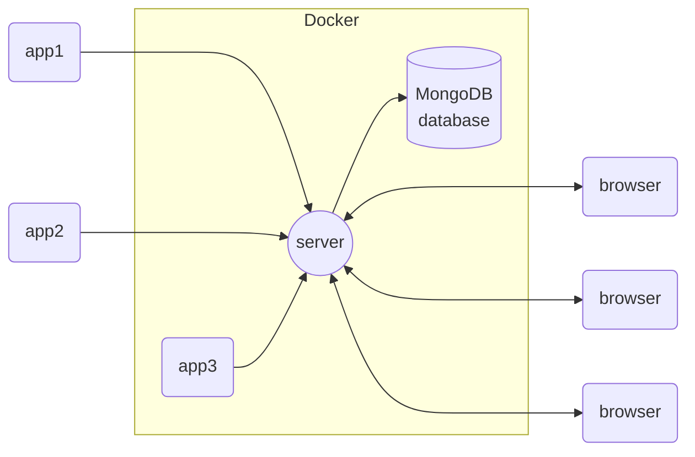
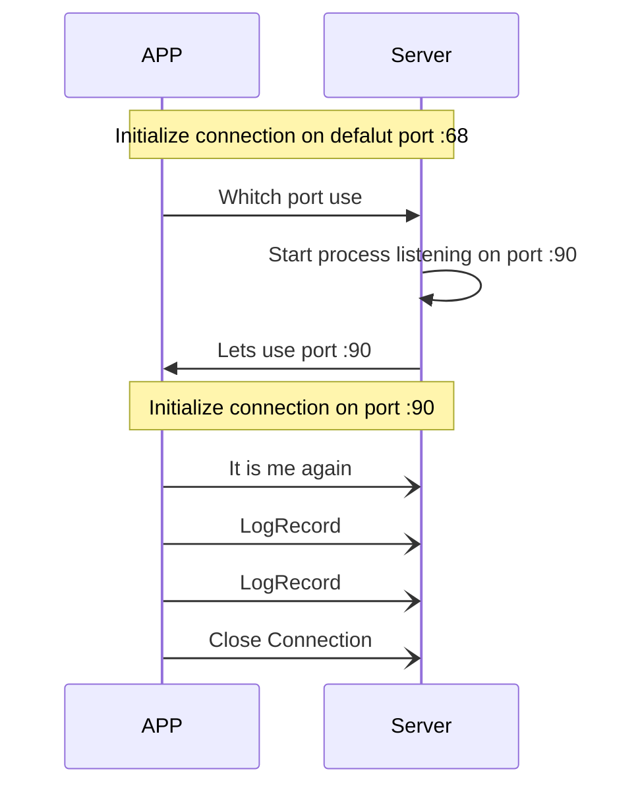
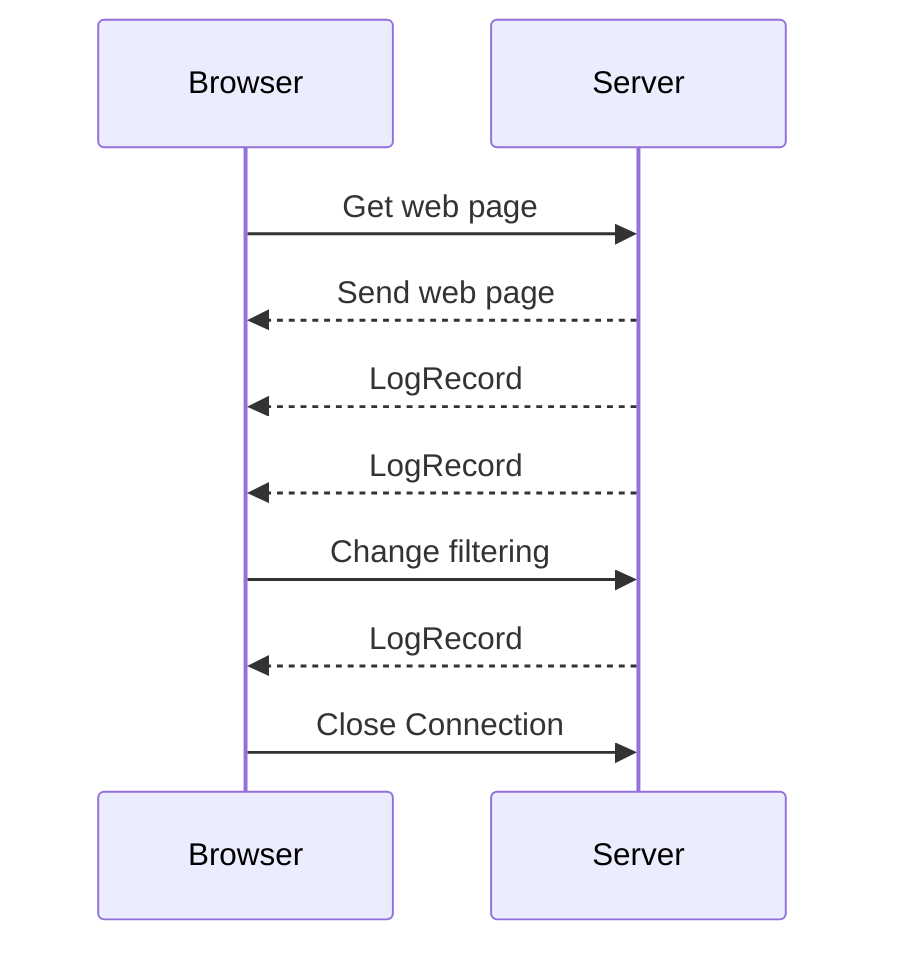
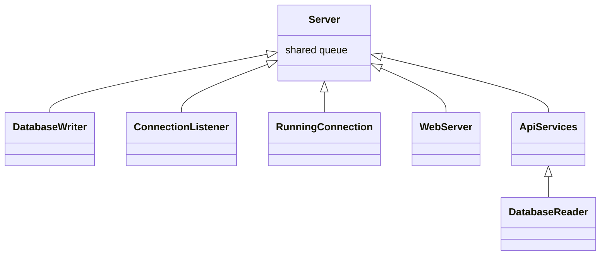

### System structure

```mermaid
flowchart LR
    B1(browser)
    B2(browser)
    B3(browser)
    A1(app1)
    A2(app2)
    A3(app3)
    S((server))
    D[(MongoDB <br> database)]
    
    
    A1--->S
    A2--->S
    
    S<--->B1
    S<--->B2
    S<--->B3
    
    subgraph Docker
    S-->D
    A3-->S
    end

```

### Communication between client and server

```mermaid
sequenceDiagram
participant A as APP
participant S as Server
    links S: {"Web Page": "http://localhost:8123/"}
    
    note over A,S: Initialize connection on defalut port :68
    A->>S: Whitch port use
    S->>S: Start process listening on port :90
    S->>A: Lets use port :90
    
    note over A,S: Initialize connection on port :90
    A-)S: It is me again
    A-)S: LogRecord
    A-)S: LogRecord
    A-)S: Close Connection
```

### Communication between browser and server

```mermaid
sequenceDiagram
participant B as Browser
participant S as Server
B->>S: Get web page
S-->>B: Send web page
S-->>B: LogRecord
S-->>B: LogRecord
B->>S: Change filtering
S-->>B: LogRecord
B->>S: Close Connection
```

### Server side processes

```mermaid
classDiagram
    Server <|-- DatabaseWriter
    Server <|-- ConnectionListener
    Server <|-- RunningConnection
    Server <|-- Web Server
    Server <|-- ApiServices
    ApiServices <|-- DatabaseReader
    class Server{
    shared queue
    }
    class DatabaseWriter{
    }
```